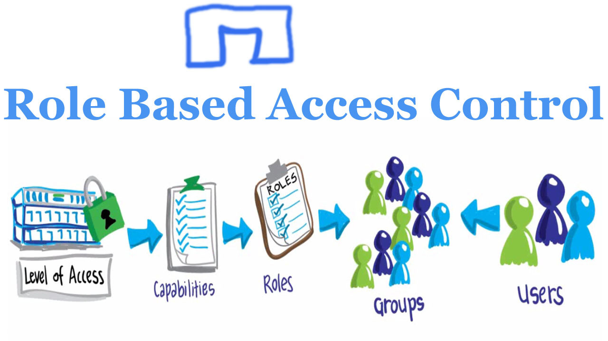
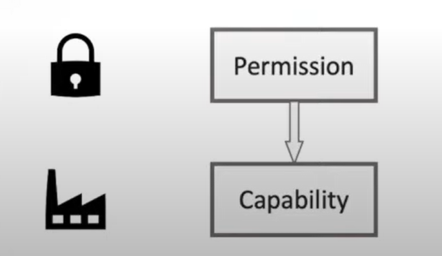
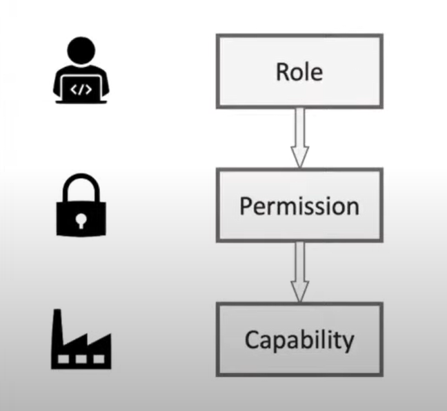
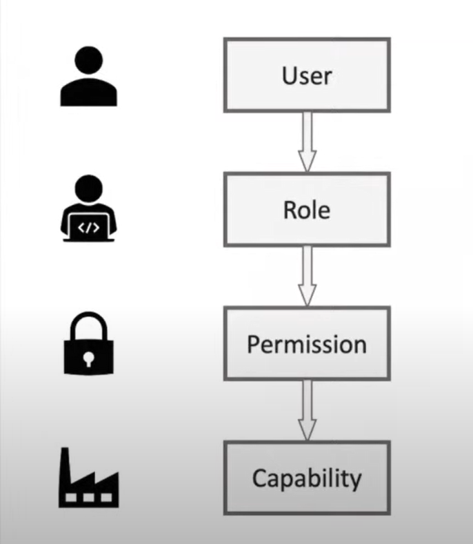

<h1>Role Based Access Control(RBAC) 😎</h1>

<h2>what is RBAC?</h2>

Role-based access control (RBAC) is a security model that defines access control based on the roles of individual users within an organization. In RBAC, access to system resources is granted based on a user's role or job function, rather than on a user-by-user basis.

In an RBAC system, users are assigned to one or more roles, and each role is associated with a set of permissions that define the actions that can be performed on specific resources. For example, a system administrator role might have permission to create, modify, or delete user accounts, while a regular user role might only have permission to view and edit their own profile.

RBAC enables organizations to manage access control policies more efficiently and effectively. By granting access based on roles, RBAC simplifies the process of managing permissions and reduces the risk of errors and inconsistencies. RBAC can also help organizations comply with regulatory requirements, as it provides a clear audit trail of who has access to sensitive data and systems.

Overall, RBAC is a powerful security model that can help organizations improve security, streamline administration, and enhance compliance.

         <ul>
         <li>used for identity and access management</li>
         <li> is not about identifying user or authenticating user , it's about managing accesss.</li>
         </ul>
          
         
Three primary rules are defined for RBAC:

         <ol>
         <li>Role assignment: A subject can exercise a permission only if the subject has selected or been assigned a role.</li>
         <li>Role authorization: A subject's active role must be authorized for the subject. With rule 1 above, this rule ensures that users can take on only roles for which they are authorized.</li>
         <li>Permission authorization: A subject can exercise a permission only if the permission is authorized for the subject's active role. With rules 1 and 2, this rule ensures that users can exercise only permissions for which they are authorized.</li>
         </ol>
         
When defining an RBAC model, the following conventions are useful:

         <uL>
         <li>S = Subject = A person or automated agent</li>
         <li>R = Role = Job function or title which defines an authority level</li>
         <li>P = Permissions = An approval of a mode of access to a resource</li>
         <li>SE = Session = A mapping involving S, R and/or P</li>
         <li>SA = Subject Assignment</li>
         <li>PA = Permission Assignment</li>
         <li>RH = Partially ordered Role Hierarchy. RH can also be written: ≥ (The notation: x ≥ y means that x inherits the permissions of y.)
</li>
<ul>
     <li>A subject can have multiple roles.</li>
     <li>A role can have multiple subjects.</li>
     <li>A role can have many permissions.
</li>
     <li>A permission can be assigned to many roles.</li>
     <li>An operation can be assigned to many permissions.</li>
     <li>A permission can be assigned to many operations.</li>
</ul>
         </ul>
         <h2>RBAC Model </h2>
         
managing access starts with you have some capabilities that are in some shape or form access controlled you have to control who has access
   to those capabilities how do you do that, it all starts with those capabilities

   
next level,
             Permission

             
one example of capability could be to say you have a database that has order data for customers and you don't want everybody
    to access orders beacause maybe this is something that is considered private information so not everybody should look into the
    orders of customers.so you have a permission that says this is a permission that somebody needs inorder to access that
   capability of order data so now you have something in place how you can control access to this capability by this capability requiring 
   that permission to be presented 

   
   <em>what's special about role based access control</em>
is now that this permission is granted to a role meaning that
    there's a certain role that then has this permission which gives access to the capability so such a role like a customer representative
    is supposed to help customer so they probably need to look into open orders of customer and therefore this role of a customer representative then gets this permission of accessing order information

      
    
The final stage in implementing RBAC is to assign roles to actual users, and this is where the scalability of RBAC in large enterprises becomes apparent. Rather than individually granting permissions to each user, permissions are assigned to roles, which are then assigned to multiple users with the same role. When a user no longer needs access, their role is simply removed, instead of having to revoke access for each individual capability. This makes RBAC a highly efficient and scalable solution for access control in large organizations.

      
