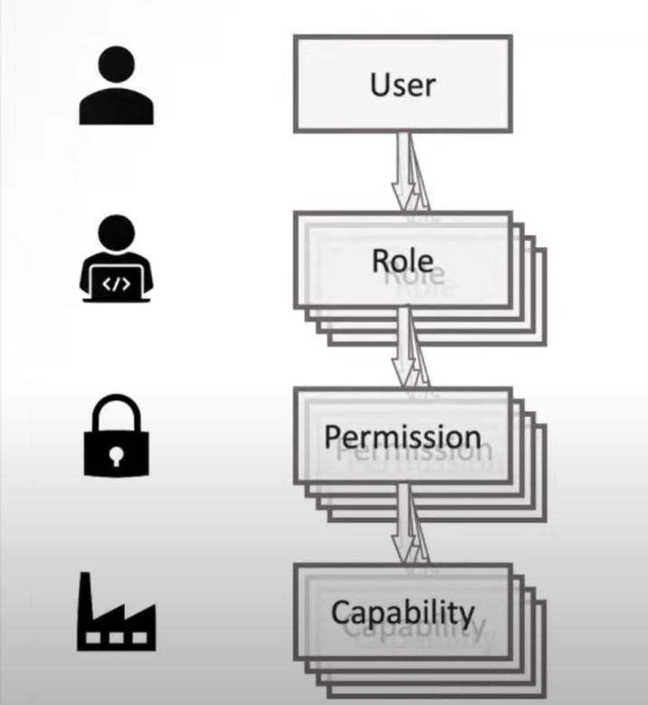

<h1>Role Based Access Control(RBAC) 😎</h1>

<h2>what is RBAC?</h2>

Role-based access control (RBAC) is a security model that defines access control based on the roles of individual users within an organization. In RBAC, access to system resources is granted based on a user's role or job function, rather than on a user-by-user basis.

In an RBAC system, users are assigned to one or more roles, and each role is associated with a set of permissions that define the actions that can be performed on specific resources. For example, a system administrator role might have permission to create, modify, or delete user accounts, while a regular user role might only have permission to view and edit their own profile.

RBAC enables organizations to manage access control policies more efficiently and effectively. By granting access based on roles, RBAC simplifies the process of managing permissions and reduces the risk of errors and inconsistencies. RBAC can also help organizations comply with regulatory requirements, as it provides a clear audit trail of who has access to sensitive data and systems.

Overall, RBAC is a powerful security model that can help organizations improve security, streamline administration, and enhance compliance.

         <ul>
         <li>used for identity and access management</li>
         <li> is not about identifying user or authenticating user , it's about managing accesss.</li>
         </ul>
          
         
Three primary rules are defined for RBAC:

         <ol>
         <li>Role assignment: A subject can exercise a permission only if the subject has selected or been assigned a role.</li>
         <li>Role authorization: A subject's active role must be authorized for the subject. With rule 1 above, this rule ensures that users can take on only roles for which they are authorized.</li>
         <li>Permission authorization: A subject can exercise a permission only if the permission is authorized for the subject's active role. With rules 1 and 2, this rule ensures that users can exercise only permissions for which they are authorized.</li>
         </ol>
         
When defining an RBAC model, the following conventions are useful:

         <uL>
         <li>S = Subject = A person or automated agent</li>
         <li>R = Role = Job function or title which defines an authority level</li>
         <li>P = Permissions = An approval of a mode of access to a resource</li>
         <li>SE = Session = A mapping involving S, R and/or P</li>
         <li>SA = Subject Assignment</li>
         <li>PA = Permission Assignment</li>
         <li>RH = Partially ordered Role Hierarchy. RH can also be written: ≥ (The notation: x ≥ y means that x inherits the permissions of y.)
</li>
<ul>
     <li>A subject can have multiple roles.</li>
     <li>A role can have multiple subjects.</li>
     <li>A role can have many permissions.
</li>
     <li>A permission can be assigned to many roles.</li>
     <li>An operation can be assigned to many permissions.</li>
     <li>A permission can be assigned to many operations.</li>
</ul>
         </ul>
         <h2>RBAC Model </h2>
         
managing access starts with you have some capabilities that are in some shape or form access controlled you have to control who has access
   to those capabilities how do you do that, it all starts with those capabilities

   
next level,
             Permission

             
one example of capability could be to say you have a database that has order data for customers and you don't want everybody
    to access orders beacause maybe this is something that is considered private information so not everybody should look into the
    orders of customers.so you have a permission that says this is a permission that somebody needs inorder to access that
   capability of order data so now you have something in place how you can control access to this capability by this capability requiring 
   that permission to be presented 

   
   <em>what's special about role based access control</em>
is now that this permission is granted to a role meaning that
    there's a certain role that then has this permission which gives access to the capability so such a role like a customer representative
    is supposed to help customer so they probably need to look into open orders of customer and therefore this role of a customer representative then gets this permission of accessing order information

      
    
The final stage in implementing RBAC is to assign roles to actual users, and this is where the scalability of RBAC in large enterprises becomes apparent. Rather than individually granting permissions to each user, permissions are assigned to roles, which are then assigned to multiple users with the same role. When a user no longer needs access, their role is simply removed, instead of having to revoke access for each individual capability. This makes RBAC a highly efficient and scalable solution for access control in large organizations.

      
      <h2>RBAC Relationship</h2>
      
To ensure an RBAC model works effectively, it is important to consider the relationships it supports in more detail. Users within an organization may have multiple roles and responsibilities, and the RBAC model should be able to accommodate this by allowing users to have one or more roles. This makes it easy to remove a specific role from a user while they continue to play other roles, thus promoting scalability. Similarly, the relationship between roles and permissions is also important, with a role often implying multiple permissions. The RBAC model should be able to handle these relationships effectively.

      
      
In the example of a customer representative role, permissions could include accessing order data or reviewing the history of interactions with a customer, such as notes on previous calls and issue resolution. It's important to note that a single role often requires multiple permissions, and this should be accommodated by the RBAC model.

      
      
It's important to note that each permission can have an impact on multiple capabilities. For example, a permission to access order data may not only give access to the system that manages current orders, but also to other systems that contain historical or tracking data about orders. As a result, such a permission can impact several capabilities. If a user is granted this permission for their role, they would have access to all relevant information about orders across multiple systems.

      
      
In summary, RBAC provides enterprise-level access control that is highly scalable due to the ability for multiple individuals to assume multiple roles, or for multiple individuals to assume the same role. Managing roles, permissions, and capabilities can be complex in large organizations, so careful consideration is necessary. Despite its popularity, RBAC is not the only method for access management, and other alternatives such as traditional access control lists or attribute-based access control may be better suited for certain organizations.

     <h3>How does the use of Role-Based Access Control (RBAC) benefit both developers and clients, and why is it important to consider its implementation from both perspectives?</h3>
     
RBAC is beneficial for both developers and clients in several ways:

 
<i>From a developer's point of view:</i>

<ol>
<li><b>Easier implementation:</b> RBAC provides a clear framework for implementing access control, which makes it easier for developers to define roles and permissions.</li>
<li><b>Reduced complexity:</b> RBAC simplifies access control by allowing developers to manage permissions at a role level rather than for individual users. This reduces complexity and the likelihood of errors.</li>
<li><b>Improved security:</b> RBAC can improve security by ensuring that only authorized personnel have access to sensitive data and resources. This reduces the risk of data breaches and other security incidents.</li>
<li><b>Better scalability:</b> RBAC enables developers to manage access control policies centrally, which makes it easier to scale and manage access control as an application grows.</li>
</ol>

<em>From a client's point of view:</em>

<ol>
<li><b>Increased security:</b> Clients can benefit from RBAC by ensuring that their data and resources are only accessible by authorized personnel. This reduces the risk of data breaches and other security incidents.</li>
<li><b>Better control:</b> RBAC provides clients with better control over who has access to their data and resources. Clients can define roles and permissions that align with their specific security requirements.</li>
<li><b>Enhanced compliance:</b> RBAC can help clients comply with regulatory requirements, such as HIPAA or GDPR, by ensuring that access to sensitive data is restricted to authorized personnel only.</li>
<li><b>More efficient access management:</b> RBAC simplifies the process of managing access control, reducing administrative overhead and costs.</li>
</ol>

Overall, RBAC can help developers and clients manage access control more efficiently, improve security, and enhance compliance with regulatory requirements.

<h2>What are the advantages of implementing Role-Based Access Control (RBAC) in an enterprise, and why is it considered a beneficial approach?</h2>

 RBAC is an effective way to manage access control in enterprises for the following reasons:

<ol>
         <li><b>Improved security: </b> RBAC enables the security team to control access to sensitive data and systems based on an individual's job function. This ensures that only authorized personnel have access to sensitive data and resources, reducing the risk of data breaches and other security incidents.</li>
         <li><b>Simplified administration:</b>RBAC allows administrators to manage access control policies centrally, reducing the complexity of managing access to different resources. This simplification leads to less administrative work, fewer errors, and increased efficiency</li>
         <li><b>Enhanced compliance: </b> RBAC can help organizations comply with regulatory requirements, such as PCI-DSS, HIPAA, and SOX, by ensuring that access to sensitive data is restricted to authorized personnel only.</li>
         <li><b>Cost savings: RBAC can help reduce the cost of managing access control, as it allows organizations to manage access control policies centrally and eliminates the need to manage access control on a per-user basis </b></li>
         <li><b>Increased productivity:</b>RBAC can help increase productivity by reducing the time it takes for employees to gain access to the resources they need to perform their jobs. By granting access based on roles, employees can be productive from day one.</li>
</ol>

In summary,<b><i> RBAC is good for enterprises because it improves security, simplifies administration, enhances compliance, saves costs, and increases productivity</i><b>.

         <h2>What are some other platforms or approaches that can be used for access control in enterprise systems, and how does Role-Based Access Control (RBAC) differ from those options?</h2>
         
There are several other access control models that can be used in addition to RBAC, including:

         <ol>
                  <li><b>Discretionary Access Control (DAC): </b> In DAC, the owner of a resource decides who can access it and what level of access they have.</li>
                  <li><b>Mandatory Access Control (MAC):</b>In MAC, access control is based on labels assigned to resources and users. Access is granted based on the level of clearance of the user and the classification of the resource.</li>
                  <li><b>Attribute-Based Access Control (ABAC):</b>In ABAC, access control is based on the attributes of the user, the resource, and the environment. Access is granted based on the values of the attributes that are specified in the access control policy.</li>
                  <li><b>Role-Based Access Control with Dynamic Separation of Duty (RBAC-DSOD): </b>In RBAC-DSOD, the traditional RBAC model is extended to include separation of duties. This ensures that no single user has the ability to perform a critical action on their own, requiring multiple users to perform the action together.</li>
                  
                  
</ol>

RBAC differs from other access control models in that it is a role-based model that assigns access to resources based on the roles of individual users. RBAC simplifies access control by allowing administrators to manage permissions at a role level, rather than for individual users. This makes it easier to manage access control policies and reduces the likelihood of errors. RBAC can also improve security by ensuring that only authorized personnel have access to sensitive data and resources.

<h2>What benefits can enterprises derive from the implementation of Role-Based Access Control (RBAC)?</h2>

 RBAC is a security model that grants access to system resources based on a user's role within an organization. RBAC is an effective way to manage access control in enterprises for the following reasons:

<ol>
<li><b>Improved security: </b>RBAC enables the security team to control access to sensitive data and systems based on an individual's job function. This ensures that only authorized personnel have access to sensitive data and resources, reducing the risk of data breaches and other security incidents.</li>
<li><b>Simplified administration: </b>RBAC allows administrators to manage access control policies centrally, reducing the complexity of managing access to different resources. This simplification leads to less administrative work, fewer errors, and increased efficiency.</li>
<li><b>Enhanced compliance:</b> RBAC can help organizations comply with regulatory requirements, such as PCI-DSS, HIPAA, and SOX, by ensuring that access to sensitive data is restricted to authorized personnel only.</li>
<li><b>Cost savings:</b>RBAC can help reduce the cost of managing access control, as it allows organizations to manage access control policies centrally and eliminates the need to manage access control on a per-user basis.</li>
<li><b>Increased productivity:</b> RBAC can help increase productivity by reducing the time it takes for employees to gain access to the resources they need to perform their jobs. By granting access based on roles, employees can be productive from day one.</li>
</ol>

In summary, RBAC is good for enterprises because it<strong><em> improves security, simplifies administration, enhances compliance, saves costs, and increases productivity</strong></em> .

<h2>In what ways does Role-Based Access Control (RBAC) differ from other access control approaches, and what are the advantages of using RBAC over other platforms?</h2>

RBAC differs from other access control models, such as Discretionary Access Control (DAC), Mandatory Access Control (MAC), and Attribute-Based Access Control (ABAC), in that it is a role-based model that assigns access to resources based on the roles of individual users. In comparison, DAC is owner-based, MAC is label-based, and ABAC is attribute-based.

The main advantage of RBAC over other access control models is that it simplifies access control by allowing administrators to manage permissions at a role level, rather than for individual users. This makes it easier to manage access control policies and reduces the likelihood of errors.<strong><em> RBAC can also improve security by ensuring that only authorized personnel have access to sensitive data and resources</em></strong>.

In terms of whether RBAC is worth using compared to other platforms, it depends on the specific needs of the organization. RBAC is a widely used and well-established access control model that has been shown to be effective in managing access control policies in a wide range of organizations. However, other access control models such as MAC or ABAC may be more suitable in certain contexts, depending on the security requirements of the organization.

Ultimately, the choice of access control model depends on a range of factors, including the complexity of the system, the types of resources that need to be secured, the size and structure of the organization, and regulatory requirements. It is important for organizations to carefully evaluate their specific needs and requirements before choosing an access control model, and to consult with experts in the field if necessary.

<h2>How are access control methods determined for different factors such as system complexity, types of resources to be secured, organization size and structure, and regulatory requirements?</h2>

here are some examples of how different access control models can be used to address the specific needs of an organization based on the factors mentioned:

<ol>
<li><strong><em>Complexity of the system:</em></strong>
For complex systems, RBAC may be a good option because it simplifies access control management by allowing administrators to manage permissions at a role level, rather than for individual users. This reduces the complexity of access control policies and makes it easier to manage permissions. MAC may also be a good option for complex systems because it allows access control to be managed based on labels, which can simplify the process of managing permissions in complex environments.
</li>
<li><strong><em>Types of resources that need to be secured:</em></strong>If an organization needs to secure resources with different levels of sensitivity or classification, MAC may be a good option. MAC allows access control to be managed based on labels, which can be used to classify resources and restrict access based on the level of clearance of the user. ABAC may also be a good option for organizations that need to secure resources based on specific attributes, such as user location or device type.</li>
<li><strong><em>Size and structure of the organization:</em></strong>For larger organizations with many users and resources, RBAC can be a good option because it allows administrators to manage permissions at a role level, which can simplify the process of managing permissions for a large number of users. ABAC may also be a good option for larger organizations because it can use user attributes to manage access control, which can be easier to manage at scale than managing permissions for individual users.</li>
<li><strong><em>Size and structure of the organization:</em></strong>For larger organizations with many users and resources, RBAC can be a good option because it allows administrators to manage permissions at a role level, which can simplify the process of managing permissions for a large number of users. ABAC may also be a good option for larger organizations because it can use user attributes to manage access control, which can be easier to manage at scale than managing permissions for individual users.</li>
<li><strong><em>Regulatory requirements:</em></strong>Depending on the specific regulatory requirements, different access control models may be more suitable. For example, if an organization needs to comply with regulations that require access to be restricted based on labels or classifications, such as the U.S. Department of Defense's Trusted Computer System Evaluation Criteria (TCSEC), then MAC may be a good option. If an organization needs to comply with regulations that require access to be restricted based on specific user attributes, such as the Health Insurance Portability and Accountability Act (HIPAA), then ABAC may be a good option.</li>
</ol>
<h3>some additional factors that organizations may want to consider when selecting an access control model:</h3>
<ol>
<li><strong><em>Scalability: </em></strong>The ability to scale an access control model to accommodate growing numbers of users, resources, and applications is an important consideration for many organizations. RBAC and ABAC can be scalable because they can be managed centrally and are designed to handle large numbers of users and resources.</li>
<li><strong><em>Flexibility:</em></strong>Organizations may need an access control model that is flexible enough to handle a range of different types of resources and applications, such as cloud-based systems or mobile devices. ABAC can be flexible in this regard because it can use a wide range of attributes to manage access control.</li>
<li><strong><em>Integration: </em></strong>The ability to integrate an access control model with other systems and applications is important for many organizations. RBAC and ABAC can be integrated with other systems and applications, which can make it easier to manage access control policies across multiple environments.</li>
<li><strong><em>Auditability: </em></strong>The ability to audit and monitor access to resources is important for many organizations, especially those that must comply with regulatory requirements. RBAC and ABAC can be auditable because they provide a centralized view of access control policies and user activity.</li>
<li><strong><em>Usability:</em></strong> The ease of use and management of an access control model is an important consideration for many organizations. RBAC can be relatively easy to use and manage because it is based on roles, which can be easily understood by administrators and users alike.</li>
<li><strong><em>Cost:</em></strong>The cost of implementing and managing an access control model is an important consideration for many organizations. RBAC can be cost-effective because it is a widely-used and well-established access control model, while ABAC can be more expensive because it requires the use of additional attributes and policies.</li>
</ol>

Overall, the selection of an access control model will depend on the specific needs and requirements of the organization, as well as the resources available to implement and manage the system.

<h2>What measures can be taken to manage the increased costs and reduced efficiency that may arise from the implementation of Role-Based Access Control (RBAC)?</h2>

RBAC can require significant administrative overhead, which can result in increased costs and reduced efficiency. Here are some ways to handle these challenges:

<ol>
<li><strong><em>Use automation:</em></strong>Automating routine administrative tasks can help reduce costs and improve efficiency. This can include automating user provisioning and deprovisioning, role assignment, and access requests.</li>
<li><strong><em>Simplify roles:</em></strong>Simplifying the role hierarchy and reducing the number of roles can help reduce administrative overhead and make it easier to manage access control policies. Organizations can consider consolidating roles and defining fewer, more general roles that encompass a broader range of job functions.</li>
<li><strong><em>Implement RBAC tools: </em></strong> Implementing RBAC tools and software can help streamline the RBAC process and reduce administrative overhead. These tools can automate tasks such as role mining, role assignment, and access request management.</li>
<li><strong><em>Regularly review and update RBAC policies:</em></strong> Regularly reviewing and updating RBAC policies and roles can help ensure that the system remains effective and efficient over time. Organizations can schedule regular audits of their RBAC system to identify any areas that need improvement.</li>
<li><strong><em>Provide user training and education: </em></strong>Providing user training and education on RBAC policies and best practices can help reduce errors and improve efficiency. Users who are knowledgeable about the RBAC system are less likely to make mistakes or require additional support.</li>

</ol>

By taking these steps, organizations can reduce the administrative overhead of RBAC, improve efficiency, and lower costs, while still maintaining a strong and effective access control system.

<h2>What are the limitations of using Role-Based Access Control (RBAC) from the perspectives of developers and clients, and what measures can be taken to address these limitations?</h2>

There are a few potential drawbacks to using RBAC in a developer and client view, but there are also ways to overcome these challenges:

<ol>
<li><strong><em>Overcomplicated Role Management:</em></strong>As an organization's needs grow more complex, it can become difficult to manage roles effectively. This can result in a proliferation of roles that may be difficult to keep track of and manage. To overcome this, organizations can consider using a Role Engineering process, which involves analyzing an organization's existing roles and defining new roles based on job functions, data access requirements, and other factors.</li>
<li><strong><em>Limited Flexibility:</em></strong>RBAC may not be flexible enough to accommodate all access control requirements. For example, it may not be able to handle complex attribute-based access control scenarios, such as location-based access control or time-based access control. To overcome this, organizations can consider using a hybrid access control model that combines RBAC with other access control models, such as ABAC or MAC, to achieve the desired level of flexibility.</li>
<li><strong><em>Risk of Role Creep: </em></strong>Over time, users may be assigned more permissions than they need, leading to role creep. This can result in security risks and a lack of control over who has access to what resources. To overcome this, organizations should implement regular reviews of access control policies and roles, and ensure that users are only assigned the permissions that they need to perform their job functions.</li>
<li><strong><em>Lack of User Awareness:</em></strong>Users may not be aware of the access control policies and rules that govern their access to resources. This can lead to confusion, frustration, and mistakes. To overcome this, organizations should provide user training and education to ensure that users are aware of the access control policies and rules that apply to them.</li>

Overall, RBAC can be a powerful and effective access control model, but it is important to understand its limitations and potential challenges, and to take steps to address them in order to ensure that the model is effective and secure.

<h2>Limitation and Potential challenges:</h2>
<ol>
<li><strong><em>Limited granularity:</em></strong>RBAC can provide role-based access control at a coarse level of granularity, which may not be suitable for organizations with complex access control requirements. For example, RBAC may not be able to handle attribute-based access control scenarios, such as location-based access control or time-based access control.</li>
<li><strong><em>Role explosion:</em></strong>Over time, as more roles are added to the system, the number of roles can grow exponentially, leading to what is known as "role explosion." This can make it difficult to manage roles effectively and to keep track of who has access to what resources.</li>
<li><strong><em>Role drift:</em></strong>Over time, the actual permissions granted to users within a role may diverge from the original intent of the role, leading to "role drift." This can result in security risks and a lack of control over who has access to what resources.</li>
<li><strong><em>Lack of user awareness:</em></strong>Users may not be aware of the access control policies and rules that govern their access to resources. This can lead to confusion, frustration, and mistakes.</li>
<li><strong><em>Implementation complexity:</em></strong> Implementing RBAC can be a complex and time-consuming process, especially for organizations with large and complex IT environments.</li>
<li><strong><em>Limited flexibility: </em></strong>RBAC may not be flexible enough to accommodate all access control requirements. For example, it may not be able to handle complex attribute-based access control scenarios, such as location-based access control or time-based access control.</li>
<li><strong><em>Administration overhead:</em></strong>RBAC can require significant administrative overhead, especially for organizations with large numbers of roles and users. This can result in increased costs and reduced efficiency.</li>
</ol>

To address these limitations and potential challenges, organizations may need to consider additional access control models, such as attribute-based access control (ABAC) or role-based access control with attribute constraints (RBAC-AC), or may need to implement additional controls, such as user training and education or regular reviews of access control policies and roles.

<h2>What strategies or approaches can be used to address the challenges and limitations that may arise from using Role-Based Access Control (RBAC)?</h2>

To overcome the limitations and challenges of RBAC, organizations can consider the following strategies:

Use a hybrid approach: One way to overcome the limitations of RBAC is to use a hybrid approach that combines RBAC with other access control models, such as attribute-based access control (ABAC) or rule-based access control (RBAC). This can help to provide more fine-grained access control that is tailored to the specific needs of the organization.

<strong><em>=>Define roles carefully:</em></strong> To avoid the problem of role explosion, organizations should define roles carefully and avoid creating too many roles. This can be achieved by consolidating roles or defining more general roles that encompass a broader range of job functions.

<strong><em>=>Regularly review and update RBAC policies:</em></strong> To avoid the problem of role drift, organizations should regularly review and update their RBAC policies and roles to ensure they reflect the current needs of the organization. This can help to keep the RBAC system effective and efficient over time.

<strong><em>=>Use automation:</em></strong> To reduce the administrative overhead of RBAC, organizations can use automation to streamline routine tasks such as role assignment, access requests, and user provisioning and deprovisioning.

<strong><em>=>Educate users:</em></strong> To ensure that users are aware of the RBAC policies and rules that govern their access to resources, organizations should provide user training and education on RBAC policies and best practices. This can help to reduce confusion, errors, and frustration.

<strong><em>=>Implement RBAC tools:</em></strong> To simplify the RBAC process and reduce administrative overhead, organizations can implement RBAC tools and software that automate tasks such as role mining, role assignment, and access request management.

By adopting these strategies, organizations can overcome the limitations and challenges of RBAC and create a robust access control system that is effective, efficient, and tailored to their specific needs.

<h2>How can we identify and address errors that may occur during the implementation of Role-Based Access Control (RBAC)?</h2>

There are several common errors that can arise in RBAC systems, and here are some ways to solve them:

<strong><em>=>Role explosion:</strong></em> This occurs when there are too many roles in the system, which can make it difficult to manage and maintain. To solve this problem, organizations can consolidate roles, define more general roles, or use a hybrid approach that combines RBAC with other access control models.

<strong><em>=>Role drift:</strong></em> This occurs when roles are not regularly reviewed and updated, which can result in users having more access than they need or accessing resources they should not have access to. To solve this problem, organizations should regularly review and update their RBAC policies and roles to ensure they reflect the current needs of the organization.

<strong><em>=>Administrative overhead:</strong></em> This refers to the cost and effort involved in managing and maintaining the RBAC system. To reduce administrative overhead, organizations can use automation to streamline routine tasks, implement RBAC tools and software, or provide user training and education on RBAC policies and best practices.

<strong><em>=>Lack of granularity:</strong></em> This occurs when the roles do not provide enough granularity to control access to resources. To solve this problem, organizations can use a hybrid approach that combines RBAC with other access control models, such as attribute-based access control (ABAC) or rule-based access control (RBAC).

<strong><em>=>Inconsistent enforcement:</strong></em> This occurs when the RBAC policies are not consistently enforced across the system, which can result in security vulnerabilities. To solve this problem, organizations should regularly test the RBAC system to ensure it is functioning correctly and consistently enforcing access control policies.

By identifying and addressing these common errors, organizations can ensure their RBAC system is effective, efficient, and providing the necessary level of security to protect their resources.

<h2>What are some examples of platforms or services that can be used in conjunction with Role-Based Access Control (RBAC), such as Azure or AWS?</h2>

Role-based access control (RBAC) is a widely used access control model that is supported by many cloud platforms and services. Here are some examples of cloud platforms that support RBAC:

<strong><em>=> Azure:</em> </strong>Azure provides RBAC as a built-in feature to manage access to Azure resources. It allows administrators to assign roles to users, groups, and service principals to control access to resources in Azure.

<strong><em>=> AWS:</em> </strong> AWS provides AWS Identity and Access Management (IAM) that allows administrators to create and manage IAM policies to control access to AWS resources. It uses RBAC to manage access to AWS resources.

<strong><em>=> Google Cloud Platform (GCP):</em> </strong> GCP provides Cloud Identity and Access Management (Cloud IAM) that allows administrators to create and manage IAM policies to control access to GCP resources. It uses RBAC to manage access to GCP resources.

<strong><em>=> Kubernetes:</em> </strong> Kubernetes provides RBAC as a built-in feature to manage access to Kubernetes resources. It allows administrators to define roles and permissions to control access to Kubernetes resources.

<strong><em>=> OpenStack:</em> </strong> OpenStack provides RBAC as a built-in feature to manage access to OpenStack resources. It allows administrators to define roles and permissions to control access to OpenStack resources.

These are just a few examples of cloud platforms that support RBAC. Many other cloud platforms and services also support RBAC as a way to manage access to resources.

<h2>What is the most commonly used cloud platform among companies, and which platform is generally considered to be the best option?</h2>

There is no single "best" cloud platform that is suitable for all companies, as each organization has unique needs and requirements. Some of the most popular cloud platforms used by companies today include:

<strong><em>1. Amazon Web Services (AWS):</em> </strong> AWS is a cloud computing platform that provides a wide range of services, including compute, storage, and networking. It is known for its scalability, flexibility, and low cost.

<strong><em>2. Microsoft Azure: </em> </strong>Azure is a cloud computing platform that provides a wide range of services, including compute, storage, and networking. It is known for its integration with Microsoft technologies and tools.

<strong><em>3. Google Cloud Platform (GCP):</em> </strong> GCP is a cloud computing platform that provides a wide range of services, including compute, storage, and networking. It is known for its advanced machine learning capabilities and developer tools.

<strong><em>4. IBM Cloud:</em> </strong> IBM Cloud is a cloud computing platform that provides a wide range of services, including compute, storage, and networking. It is known for its security and compliance features.

<strong><em>5. Oracle Cloud: </em> </strong>Oracle Cloud is a cloud computing platform that provides a wide range of services, including compute, storage, and networking. It is known for its enterprise-grade features and integration with Oracle technologies.

The choice of cloud platform depends on several factors, such as the specific needs of the organization, the level of expertise and resources available, and the budget. It is important to carefully evaluate the features, pricing, and support offered by each platform before making a decision.

In terms of popularity, AWS is currently the most widely used cloud platform, followed by Azure and GCP. However, the cloud computing market is constantly evolving, and the popularity of different platforms may change over time.

<h2>What platform is typically utilized by companies in the 5G Networking industry?</h2>

There is no single cloud platform that is exclusively used for 5G networking companies, as each organization has unique needs and requirements. However, many cloud platforms provide services and tools that are relevant to 5G networking, such as edge computing, virtualization, and network function virtualization (NFV). Some examples of cloud platforms that are used by 5G networking companies include:

<strong><em>=> AWS: </em> </strong>AWS provides a range of services that are relevant to 5G networking, including Amazon Elastic Compute Cloud (EC2), Amazon Elastic Kubernetes Service (EKS), and AWS Outposts, which enables customers to run AWS infrastructure on-premises.

<strong><em>=> Microsoft Azure:</em> </strong> Azure provides a range of services that are relevant to 5G networking, including Azure Edge Zones, Azure Virtual Machines, and Azure Kubernetes Service (AKS).

<strong><em>=> Google Cloud Platform (GCP):</em> </strong> GCP provides a range of services that are relevant to 5G networking, including Google Kubernetes Engine (GKE), Google Cloud Functions, and Google Cloud IoT.

<strong><em>=> IBM Cloud:</em> </strong> IBM Cloud provides a range of services that are relevant to 5G networking, including IBM Cloud Pak for Applications, IBM Cloud Private, and IBM Cloud Object Storage.

<strong><em> => Oracle Cloud: </em> </strong> Oracle Cloud provides a range of services that are relevant to 5G networking, including Oracle Cloud Infrastructure (OCI), Oracle Autonomous Database, and Oracle Cloud VMware Solution.

The choice of cloud platform depends on several factors, such as the specific needs of the organization, the level of expertise and resources available, and the budget. It is important to carefully evaluate the features, pricing, and support offered by each platform before making a decision.

<h2>When considering factors such as features, pricing, and support, which platform is generally regarded as the best option?</h2>

Determining the "best" cloud platform depends on several factors, including the specific needs of the organization, the level of expertise and resources available, and the budget. Each of the cloud platforms mentioned above has its own strengths and weaknesses, and may be more suitable for certain use cases than others.

In terms of features, each cloud platform offers a wide range of services and tools that can be used for different purposes. AWS has the most comprehensive set of services, followed by Azure and GCP. IBM Cloud and Oracle Cloud also offer a range of services, but may have a narrower focus compared to the other platforms.

In terms of pricing, each cloud platform has its own pricing model, which can be complex and difficult to compare. AWS is known for its low pricing, but may not be the most cost-effective option for all use cases. Azure and GCP have competitive pricing and offer discounts for long-term usage, while IBM Cloud and Oracle Cloud may be more expensive.

In terms of support, each cloud platform offers different levels of support and customer service. AWS has a large community and a wide range of documentation, but may not provide as much personalized support compared to other platforms. Azure and GCP offer comprehensive support options, including 24/7 customer service and technical support, while IBM Cloud and Oracle Cloud offer personalized support and consulting services.

Overall, it is important to carefully evaluate each cloud platform based on the specific needs and requirements of the organization. It may be helpful to conduct a cost-benefit analysis, and to consider factors such as scalability, security, and integration with existing infrastructure.

<h2>In the context of companies operating in the 5G Networking industry, which platform is considered to be the best option when evaluating factors such as features, pricing, and support?</h2>

There is no one-size-fits-all answer to which cloud platform is the best for 5G networking companies, as each organization has unique needs and requirements. However, AWS, Azure, GCP, IBM Cloud, and Oracle Cloud are all widely used by 5G networking companies and provide a range of services and tools that are relevant to this industry.

When evaluating which platform is the best for a specific 5G networking company, it is important to consider factors such as the specific needs and requirements of the organization, the level of expertise and resources available, and the budget. It may also be helpful to conduct a thorough evaluation of each platform's features, pricing, and support, and to compare these factors based on the organization's specific use case.

Ultimately, the best cloud platform for a 5G networking company will depend on a variety of factors, and it is important to carefully evaluate all options before making a decision.

<h2>What is the cost associated with using RBAC on the AWS platform, and how can this cost be determined for clients?</h2>

The cost of using RBAC on AWS (Amazon Web Services) will depend on several factors such as the number of users, the number of roles, the complexity of the permissions required, and the specific AWS services being used.

AWS offers several pricing models, including pay-as-you-go, reserved instances, and spot instances. The cost of RBAC on AWS will vary depending on the pricing model chosen and the specific services being used.

Additionally, AWS provides a free tier for some of its services, including AWS Identity and Access Management (IAM), which can be used to implement RBAC. This may be a good option for small businesses or those looking to try out RBAC before committing to a paid plan.

It is important to note that the cost of RBAC on AWS should be considered in the context of the overall benefits it provides. RBAC can help improve security, simplify permissions management, and reduce the risk of human error in access control, which can save time and money in the long run.

To determine the specific cost of RBAC on AWS for a client, it is recommended to consult with an AWS expert or use the AWS cost calculator to estimate the costs based on the specific use case and requirements.

